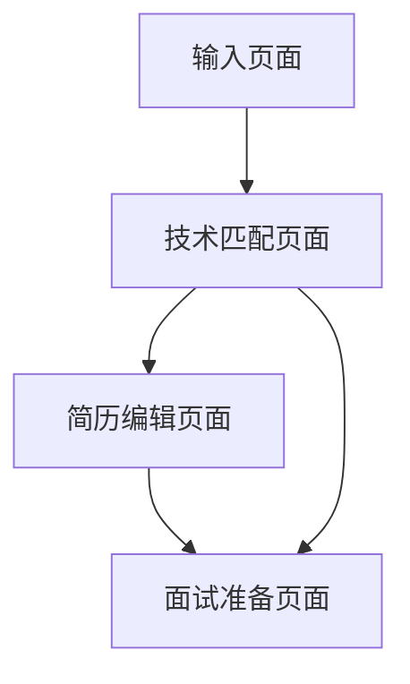

## 1. 产品概述
ResuMatch是一个智能的JD↔简历分析工具，帮助求职者优化简历匹配度。通过AI技术分析职位描述和简历内容，提供精准的技术匹配分析、简历优化建议和个性化面试准备。

目标用户：正在求职的技术人员，包括软件工程师、数据科学家、DevOps工程师等技术岗位求职者。

## 2. 核心功能

### 2.1 用户角色
| 角色 | 注册方式 | 核心权限 |
|------|----------|----------|
| 求职者 | 邮箱注册 | 使用所有分析功能，保存分析历史 |

### 2.2 功能模块
ResuMatch包含以下核心页面：
1. **输入页面**：输入公司信息、JD和简历，选择文本格式
2. **技术匹配页面**：技术关键词提取与匹配分析
3. **简历编辑页面**：优化建议与实时预览
4. **面试准备页面**：三类个性化面试问题生成

### 2.3 页面详情
| 页面名称 | 模块名称 | 功能描述 |
|----------|----------|----------|
| 输入页面 | 公司信息输入 | 输入公司名称、职位名称、JD链接 |
| 输入页面 | JD输入区域 | 粘贴职位描述，支持LaTeX/Markdown/纯文本格式选择 |
| 输入页面 | 简历输入区域 | 粘贴简历内容，支持多种格式输入 |
| 输入页面 | 格式选择器 | 下拉选择文本格式类型 |
| 简历编辑页面 | 版本历史 | 显示所有保存的简历版本，支持查看和回滚 |
| 简历编辑页面 | 保存草稿 | 自动保存当前编辑内容，生成新版本 |
| 技术匹配页面 | 关键词提取 | 自动从JD提取技术关键词（语言、前后端、云服务、DevOps、ML/AI） |
| 技术匹配页面 | 匹配分析 | 与简历内容逐项对比，支持别名匹配（如K8s↔Kubernetes） |
| 技术匹配页面 | 匹配结果展示 | 显示Strong/Partial/Missing状态，提供上下文片段 |
| 技术匹配页面 | 整体评分 | 计算并显示综合匹配分数 |
| 简历编辑页面 | 优化建议 | 基于分析结果生成缺失关键词、量化不足、领导力经验等建议 |
| 简历编辑页面 | 编辑区域 | 提供可编辑的简历文本框 |
| 简历编辑页面 | 实时预览 | 并排显示编辑后的简历预览 |
| 简历编辑页面 | 版本历史 | 显示所有保存的简历版本，支持查看和回滚 |
| 简历编辑页面 | 保存草稿 | 自动保存当前编辑内容，生成新版本 |
| 面试准备页面 | 简历相关问题 | 基于匹配技术栈生成个性化技术问题 |
| 面试准备页面 | 筛选电话问题 | 生成HR常问的通用筛选问题 |
| 面试准备页面 | 技术经理问题 | 针对简历gap生成技术+行为面试问题 |
| 面试准备页面 | 准备技巧 | 提供面试回答技巧和注意事项 |

## 3. 核心流程
### 用户操作流程：
1. 用户在输入页面粘贴JD和简历内容，选择相应格式
2. 系统分析并跳转到技术匹配页面，展示关键词匹配结果和评分
3. 用户查看匹配详情，点击优化建议跳转到简历编辑页面
4. 在简历编辑页面，用户根据建议修改简历并实时预览
5. 完成后进入面试准备页面，获取个性化面试问题和准备建议

## 4. 用户界面设计

### 4.1 设计风格
- **主色调**：深蓝色 (#1e40af) 作为品牌色，搭配浅灰色 (#f8fafc) 背景
- **按钮样式**：圆角矩形，主要操作为实心蓝色按钮，次要操作为边框按钮
- **字体**：系统默认字体，标题16-18px，正文14px，小字12px
- **布局风格**：顶部Tab导航，卡片式内容区域，左右分栏布局
- **图标风格**：使用简洁的线性图标，如文档、分析、编辑、面试等主题图标

### 4.2 页面设计概述
| 页面名称 | 模块名称 | UI元素 |
|----------|----------|--------|
| 输入页面 | 公司信息区域 | 顶部输入公司名称、职位名称、JD链接的表单组 |
| 输入页面 | 双栏布局 | 左侧JD输入框，右侧简历输入框，底部格式选择器 |
| 技术匹配页面 | 匹配结果卡片 | 关键词分类展示，颜色编码匹配状态（绿色Strong/黄色Partial/红色Missing） |
| 简历编辑页面 | 并排布局 | 左侧编辑区域，右侧Markdown预览，顶部版本历史按钮 |
| 简历编辑页面 | 版本历史面板 | 侧边栏显示所有版本列表，包含时间戳和版本号 |
| 简历编辑页面 | 自动保存提示 | 底部显示上次保存时间和保存状态 |
| 面试准备页面 | Tab切换 | 三类问题分别展示，可折叠的问题卡片，突出显示关键建议 |

### 4.3 响应式设计
- 桌面端优先设计，支持1200px以上宽度的最佳体验
- 平板端自适应，保持核心功能可用性
- 移动端简化界面，重点突出核心分析结果

### 4.4 交互优化
- Tab切换动画平滑过渡
- 关键词匹配结果hover显示详细上下文
- 编辑区域实时保存，防止数据丢失
- 面试问题支持一键复制功能