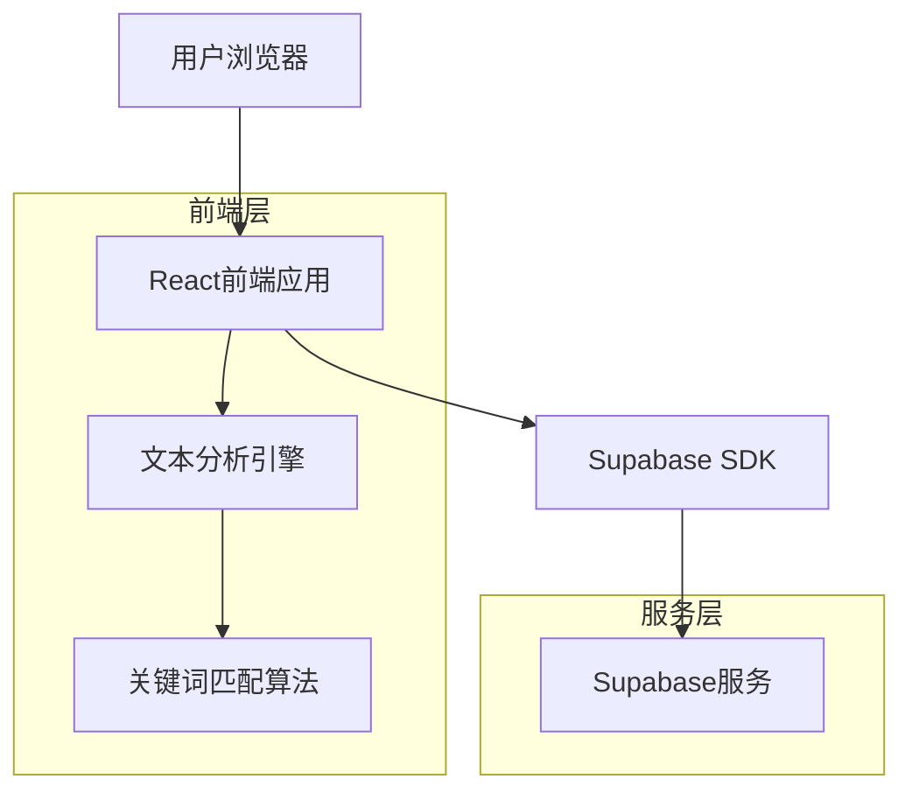
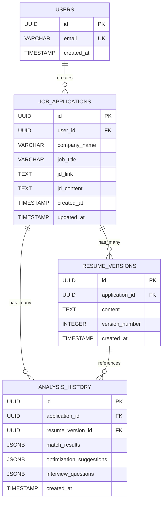

## 1. 架构设计



## 2. 技术描述

- **前端**: React@18 + tailwindcss@3 + vite
- **初始化工具**: vite-init
- **后端**: 无（客户端处理逻辑）
- **数据库**: Supabase（仅用于保存分析历史）
- **状态管理**: React Context + useState
- **文本处理**: 纯JavaScript实现，无需后端API

## 3. 路由定义

| 路由 | 用途 |
|------|------|
| / | 主页，包含四个Tab的仪表板 |
| /input | 输入页面，JD和简历输入 |
| /match | 技术匹配分析页面 |
| /edit | 简历编辑和优化建议页面 |
| /interview | 面试准备问题生成页面 |

## 4. 核心数据结构

### 4.1 关键词分类定义
```typescript
interface TechKeyword {
  id: string;
  name: string;
  aliases: string[];
  category: 'language' | 'frontend' | 'backend' | 'cloud' | 'devops' | 'ml_ai';
  matchLevel: 'strong' | 'partial' | 'missing';
  context?: string;
}

interface MatchResult {
  keywords: TechKeyword[];
  overallScore: number;
  categoryScores: Record<string, number>;
}
```

### 4.2 优化建议类型
```typescript
interface OptimizationSuggestion {
  id: string;
  type: 'missing_keyword' | 'quantification' | 'leadership' | 'clarity';
  priority: 'high' | 'medium' | 'low';
  description: string;
  suggestion: string;
  example?: string;
}
```

### 4.3 面试问题分类
```typescript
interface InterviewQuestion {
  id: string;
  category: 'resume_based' | 'screening' | 'hiring_manager';
  question: string;
  tips: string[];
  relatedKeywords?: string[];
}
```

## 5. 关键词匹配算法

### 5.1 技术关键词库
```javascript
const techKeywords = {
  language: [
    { name: 'JavaScript', aliases: ['JS', 'ES6', 'TypeScript'] },
    { name: 'Python', aliases: ['Py'] },
    { name: 'Java', aliases: [] },
    { name: 'Go', aliases: ['Golang'] }
  ],
  frontend: [
    { name: 'React', aliases: ['React.js', 'ReactJS'] },
    { name: 'Vue', aliases: ['Vue.js', 'VueJS'] },
    { name: 'Angular', aliases: [] }
  ],
  backend: [
    { name: 'Node.js', aliases: ['NodeJS', 'Node'] },
    { name: 'Express', aliases: ['Express.js'] },
    { name: 'Django', aliases: [] }
  ],
  cloud: [
    { name: 'AWS', aliases: ['Amazon Web Services'] },
    { name: 'Azure', aliases: ['Microsoft Azure'] },
    { name: 'GCP', aliases: ['Google Cloud', 'Google Cloud Platform'] }
  ],
  devops: [
    { name: 'Docker', aliases: [] },
    { name: 'Kubernetes', aliases: ['K8s', 'K8'] },
    { name: 'CI/CD', aliases: ['CICD', 'Continuous Integration'] }
  ],
  ml_ai: [
    { name: 'TensorFlow', aliases: ['TF'] },
    { name: 'PyTorch', aliases: [] },
    { name: 'Machine Learning', aliases: ['ML'] }
  ]
};
```

### 5.2 匹配逻辑
```javascript
function extractKeywords(text, keywordLibrary) {
  const results = [];
  const lowerText = text.toLowerCase();
  
  for (const [category, keywords] of Object.entries(keywordLibrary)) {
    for (const keyword of keywords) {
      const allTerms = [keyword.name, ...keyword.aliases];
      const matchLevel = checkMatchLevel(lowerText, allTerms);
      
      if (matchLevel !== 'missing') {
        results.push({
          name: keyword.name,
          category,
          matchLevel,
          context: extractContext(lowerText, allTerms)
        });
      }
    }
  }
  
  return results;
}

function checkMatchLevel(text, terms) {
  const primaryMatch = terms.some(term => 
    text.includes(term.toLowerCase())
  );
  
  const partialMatch = terms.some(term => 
    text.includes(term.toLowerCase().split(' ')[0])
  );
  
  if (primaryMatch) return 'strong';
  if (partialMatch) return 'partial';
  return 'missing';
}
```

## 6. 数据模型

### 6.1 数据模型关系图


### 6.1 用户表
```sql
CREATE TABLE users (
    id UUID PRIMARY KEY DEFAULT gen_random_uuid(),
    email VARCHAR(255) UNIQUE NOT NULL,
    created_at TIMESTAMP WITH TIME ZONE DEFAULT NOW()
);

-- 权限设置
GRANT SELECT ON users TO anon;
GRANT ALL PRIVILEGES ON users TO authenticated;
```

### 6.2 求职申请表
```sql
CREATE TABLE job_applications (
    id UUID PRIMARY KEY DEFAULT gen_random_uuid(),
    user_id UUID REFERENCES users(id) ON DELETE CASCADE,
    company_name VARCHAR(255) NOT NULL,
    job_title VARCHAR(255) NOT NULL,
    jd_link TEXT,
    jd_content TEXT NOT NULL,
    created_at TIMESTAMP WITH TIME ZONE DEFAULT NOW(),
    updated_at TIMESTAMP WITH TIME ZONE DEFAULT NOW()
);

-- 创建索引
CREATE INDEX idx_job_applications_user_id ON job_applications(user_id);
CREATE INDEX idx_job_applications_created_at ON job_applications(created_at DESC);

-- 权限设置
GRANT SELECT ON job_applications TO anon;
GRANT ALL PRIVILEGES ON job_applications TO authenticated;
```

### 6.3 简历版本表
```sql
CREATE TABLE resume_versions (
    id UUID PRIMARY KEY DEFAULT gen_random_uuid(),
    application_id UUID REFERENCES job_applications(id) ON DELETE CASCADE,
    content TEXT NOT NULL,
    version_number INTEGER NOT NULL,
    created_at TIMESTAMP WITH TIME ZONE DEFAULT NOW()
);

-- 创建索引
CREATE INDEX idx_resume_versions_application_id ON resume_versions(application_id);
CREATE INDEX idx_resume_versions_created_at ON resume_versions(created_at DESC);

-- 权限设置
GRANT SELECT ON resume_versions TO anon;
GRANT ALL PRIVILEGES ON resume_versions TO authenticated;
```

### 6.4 分析历史表
```sql
CREATE TABLE analysis_history (
    id UUID PRIMARY KEY DEFAULT gen_random_uuid(),
    application_id UUID REFERENCES job_applications(id) ON DELETE CASCADE,
    resume_version_id UUID REFERENCES resume_versions(id) ON DELETE CASCADE,
    match_results JSONB NOT NULL,
    optimization_suggestions JSONB NOT NULL,
    interview_questions JSONB NOT NULL,
    created_at TIMESTAMP WITH TIME ZONE DEFAULT NOW()
);

-- 创建索引
CREATE INDEX idx_analysis_history_application_id ON analysis_history(application_id);
CREATE INDEX idx_analysis_history_created_at ON analysis_history(created_at DESC);

-- 权限设置
GRANT SELECT ON analysis_history TO anon;
GRANT ALL PRIVILEGES ON analysis_history TO authenticated;
```

## 7. 组件架构

### 7.1 核心组件结构
```
src/
├── components/
│   ├── InputTab/
│   │   ├── JDInput.jsx
│   │   ├── ResumeInput.jsx
│   │   └── FormatSelector.jsx
│   ├── TechMatchTab/
│   │   ├── KeywordMatch.jsx
│   │   ├── MatchScore.jsx
│   │   └── ContextSnippet.jsx
│   ├── ResumeEditTab/
│   │   ├── Editor.jsx
│   │   ├── Preview.jsx
│   │   └── SuggestionList.jsx
│   └── InterviewPrepTab/
│       ├── QuestionCategory.jsx
│       ├── QuestionCard.jsx
│       └── TipsSection.jsx
├── utils/
│   ├── keywordExtractor.js
│   ├── matchAnalyzer.js
│   └── suggestionGenerator.js
└── contexts/
    └── AnalysisContext.jsx
```

### 7.2 状态管理
```javascript
// AnalysisContext 状态结构
const initialState = {
  application: {
    id: null,
    companyName: '',
    jobTitle: '',
    jdLink: '',
    jobDescription: '',
    createdAt: null
  },
  input: {
    resumeContent: '',
    format: 'markdown'
  },
  versions: [],
  currentVersion: null,
  matchResults: {
    keywords: [],
    overallScore: 0,
    categoryScores: {}
  },
  suggestions: [],
  interviewQuestions: {
    resume_based: [],
    screening: [],
    hiring_manager: []
  }
};
```

## 8. 性能优化

### 8.1 文本处理优化
- 使用Web Workers处理大量文本分析，避免阻塞主线程
- 实现关键词索引缓存，提升重复分析性能
- 采用虚拟滚动展示长列表匹配结果

### 8.2 用户体验优化
- 实现渐进式分析，优先展示重要匹配结果
- 添加加载状态指示器，提升等待体验
- 支持分析结果本地缓存，减少重复计算